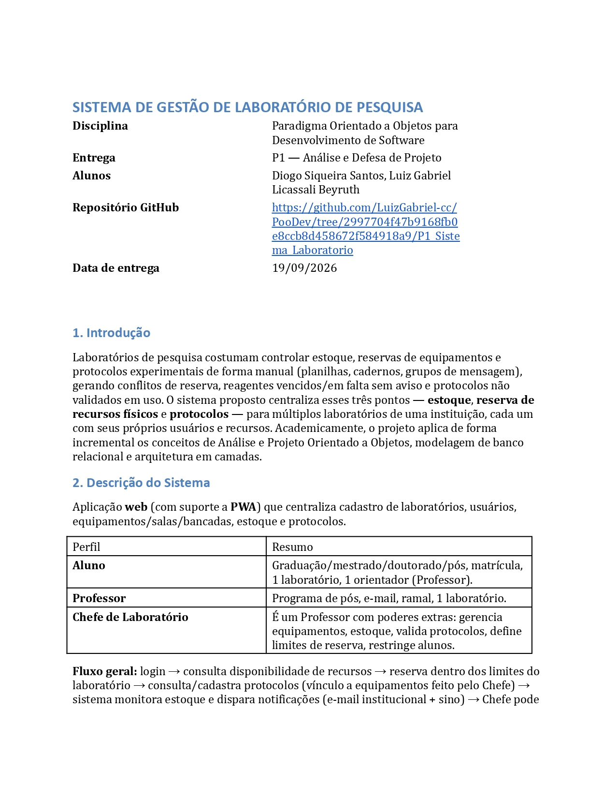

## **Sistema de Gestão de Laboratório de Pesquisa**

Projeto para a disciplina **Paradigma Orientado a Objetos para Desenvolvimento de Software**, do Curso de Ciência da Computação - UENF.

A proposta do projeto é desenvolver a capacidade de projetar e implementar softwares utilizando o paradigma orientado a objetos, aplicando conceitos, técnicas e boas práticas de programação em um projeto real, de forma incremental e colaborativa, visando a criação de soluções eficientes, reutilizáveis e de fácil manutenção.

## **PDF Inicial do Projeto**
Serve como estrutura modular para o desenvolvimento final do projeto e mapeamento dos requisitos.

  
   
  <em>Clique na imagem acima ou <a href="./SistemaDeGestaoDeLaboratorio.pdf"><strong>clique aqui para abrir o PDF completo</strong></a>.</em>

